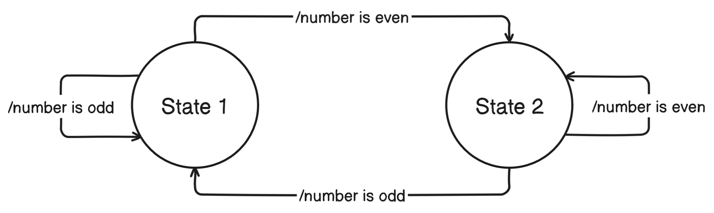

# AEROLOGIC (Example Branch)


The diagram visualizes a ROS 2 node within the `sm_example` package with two states, `State 1` and `State 2`. These states toggle based on the parity of numbers publish on the `/number` topic. The `cl_publisher` client generates random numbers,publishing them through client behaviors `cb_publish_high` and `cb_publish_low`. The `cl_subscriber` client listens to `/number` and throws events using the `cb_subscriber_behavior` client behavior, driving state transitions defined in `st_state_1` and `st_state_2`.

## Overview

AErial Routing and Operational LOGistics Integration Code

For a deeper understanding of the underlying concepts and terminology used in this project, please refer to the [ROS 2 documentation](https://docs.ros.org/en/rolling/Concepts.html) and the [SMACC documentation](https://smacc.dev/intro-to-substate-objects/).

## Prerequisites

-   [Docker](https://docker.com)

## Installation and Setup

1. Build the image and start the container

```sh
docker-compose up -d --build
```

2. Enter the container

```sh
docker exec -it aerologic bash
```

**note:** Source the following environments before running any ros or build related commands

```sh
source /opt/ros/foxy/setup.bash
source ~/workspace/dep/install/setup.bash
source ~/workspace/dev/install/setup.bash
```

3. Build packages in the `dev` workspace

```sh
cd ~/workspace/dev
colcon build
```

4. Exit and stop the container

```sh
exit
docker-compose down
```

## Development Guidelines

### SMACC2 Naming Conventions

This project follows the [SMACC2 naming conventions](https://smacc.dev/naming-convention/) to ensure consistency and readability throughout the codebase.

## Resources

### SMACC (State Machine Asynchronous C++)

SMACC is a library designed for building complex, high-performance state machines using the ROS framework. It provides a structured way to control behaviors and responses in different scenarios. I _highly_ recommend watching the presentation.

-   **Documentation:** https://smacc.dev/
-   **Presentation:** https://www.youtube.com/watch?v=y6BAqDmHEwA&t=147s
-   **Podcast Interview/Explanation:** https://www.youtube.com/watch?v=3ju1g6g51ss
-   **Source Code:** https://github.com/robosoft-ai/SMACC2

### ROS (Robot Operating System)

ROS is a flexible framework for writing robot software. It's a collection of tools, libraries, and conventions aimed at simplifying the development of complex robotic behaviors.
